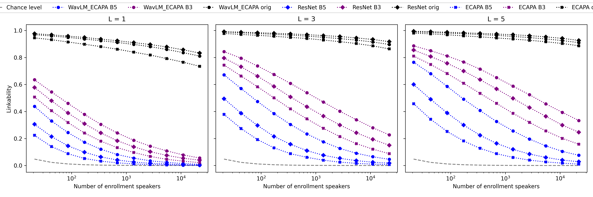
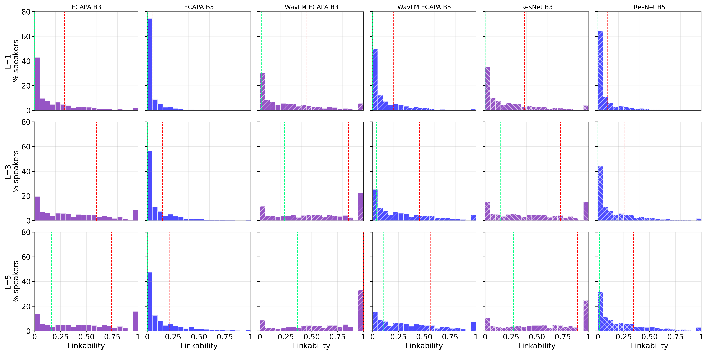
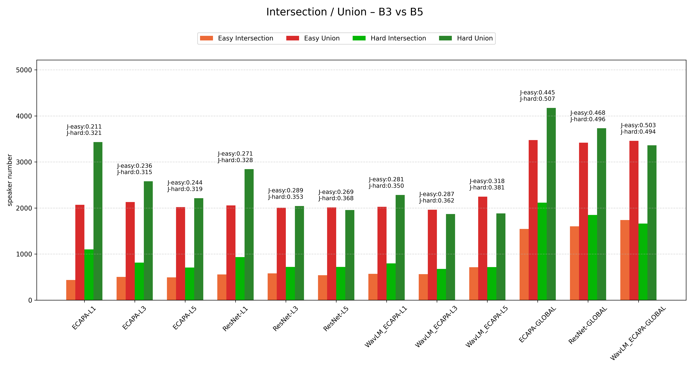
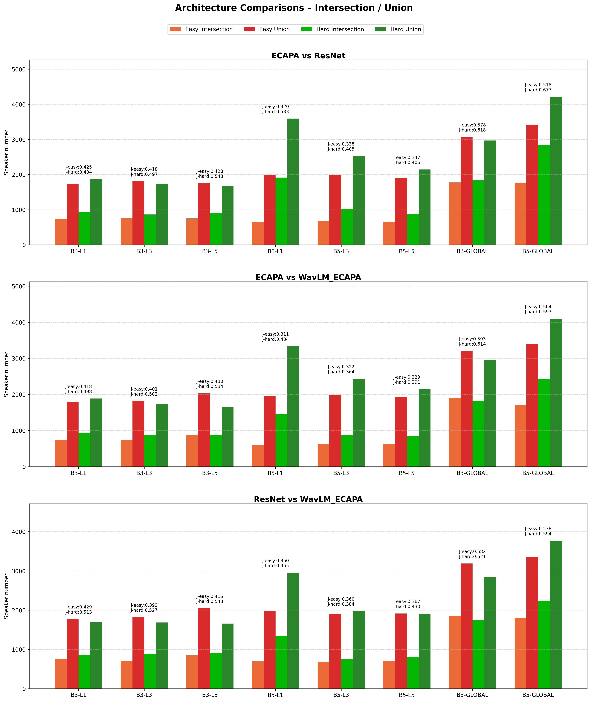
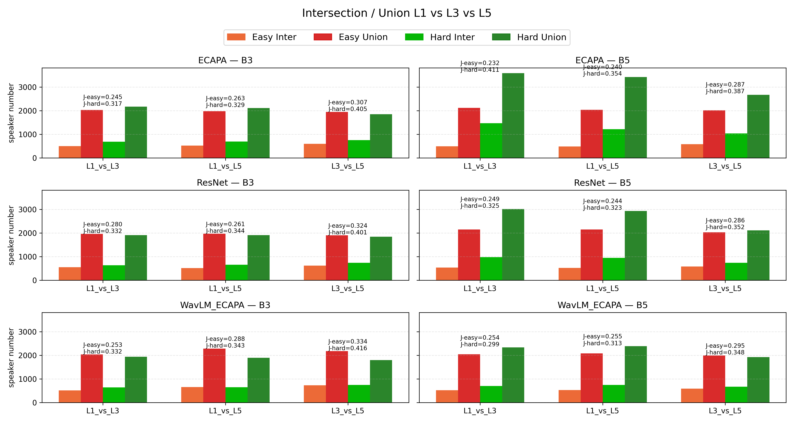
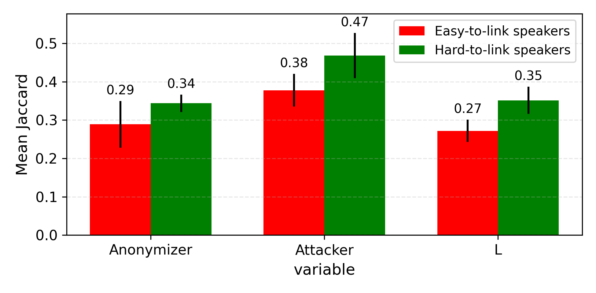

This repository is an implementation of the Linkability metric for voice anonymization evaluation depicted in [paper](https://www.isca-archive.org/interspeech_2025/vauquier25_interspeech.pdf) and the reproduction and extension of the experiment they led on the CommonVoice Dataset.

---
## Data
### Test (CommonVoice)
You can download the 11th version of CommonVoice english here : https://datacollective.mozillafoundation.org/organization/cmfh0j9o10006ns07jq45h7xk

Lists of the utterances and speaker ID for the A (enrollment) et B (trial) is available in the repo : [cv11-A](list-cv11-A) [TO DO](list-cv11-B)

### Train LibriSpeech-train-clean-360
The training set for the attackers is available here : https://www.openslr.org/12 

## Anonymization 
Training and test data should be anonymized with the same anonymizers and same parameters. The anonymizers used in this experiment are Baseline 3 and Baseline 5 of the VoicePrivacyChallenge 2025. 

We used the implementation of the authors of those anonymizers instead of the VoicePrivacyChallenge's implementation which is less practical, they are available here : [B3](https://github.com/DigitalPhonetics/speaker-anonymization) [B5](https://github.com/deep-privacy/SA-toolkit).

Note that this step can take a lot of time depending on your ressources : the train set is not such a challenge to anonymize due to its rather small size but anonymizing the CommonVoice dataset in a reasonable amount of time requires a lot of ressources, especially for B3. As an indication : 
* Anonymizing CommonVoice with B3 took around 20 hours with 70 nodes of 4 32Go GPUs
* Anonymizing CommonVoice with B5 took ~48 hours with 1 node of 4 32Go GPUs

Note that multi-node computation is not implemented for either anonymizer and that you would have to implement it yourself or launch several jobs in parallel to reduce computation time. 

## Attackers 
This section provides the links to the implementations of the ASV systems we used in the paper. Each attacker has been trained on the LibriSpeech-train-clean-360 set, and no modification was made on the config files provided by the repository : 

* **ECAPA** : VoicePrivacyChallenge2025 baseline, implementation can be found in the VPC's repo : https://github.com/Voice-Privacy-Challenge/Voice-Privacy-Challenge-2024/tree/main/evaluation/privacy/asv . Training took ~10 hours on a 4 32 Go GPU node 
* **WavLM_ECAPA** : Comes from the sidekit toolkit : https://github.com/Voice-Privacy-Challenge/Voice-Privacy-Challenge-2024/tree/main/evaluation/privacy/asv . Training took ~48 hours on a 4 32Go GPU node
* **ResNet** : repo cannot be linked yet because it would compromise the anonymity of one of the authors

## Metric Description 
The Linkability metric has been created to evaluate the second criteria defining anonymized data : *data can be considered anonymous if it is not possible to link records that pertain to the same data subject*

In the case of speech anonymization, Linkability measures the risk that an attacker matches a speaker embedding $x_{test}$ computed from one or more anonymized test utterances, with the enrollment embedding $x_{enroll}$  corresponding to the same speaker $i$ among a set of $N'$ enrollment speakers.

Linkage succeeds if:  

$$
s(x_{\text{test}}, x_{\text{enroll}}^i) > \max_{j \neq i} s(x_{\text{test}}, x_{\text{enroll}}^j)
$$

The Linkability metric is defined as the probability of linkage over all test data:

$$
\pi_{\text{link}} = \Pr \left( s(x_{\text{test}}^i, x_{\text{enroll}}^i) > \max_{j \neq i} s(x_{\text{test}}^i, x_{\text{enroll}}^j) \right)
$$

A low $\pi_{\text{link}}$ indicates that it is difficult for an attacker to correctly  
link anonymized recordings to the correct speaker, thus supporting the claim of effective anonymization.

## Usage
This section presents how the repo works. Note that you have to complete all of the above steps in order to start using it : speaker embeddings (on anonymized or original speech) have to be extracted for enrollment and trial separatly, in the form of a .pkl dictionary with {utterance : embedding}. The config files and plot generations work for the experiment depicted in the paper, if you want to change de test set, modification should be done accordingly. 
### Installation
```py
pip install -r requirements.txt
```
Note that the repo can work without pytorch, the only use of it is when computing the cosine similarity matrix but this is not much longer on CPU.
### Computing Linkability
The metric computation revolves around the `SimMatrix` class & a few scripts to get per-speakers scores and plot results.

#### SimMatrix
The `SimMatrix` class aims to compute the Cosine Similarity Matrix pairing each test utterances against each enroll utterances. It also pre-computes the scores on N for further processing.
It takes as arguments :
- `enroll_path` and `trial_path` :  the pickle files (test and enroll set) containing a dictionary of speaker embeddings of shape `embedding_dic[speaker_id] = List[speaker_embeddings]`
- `L` :  which is the number of utterances used to compute the embedding of each test speaker
- `seed` : to initialize the random number generator involved in the choice of the utterances chosen to compute the average embeddings
- `model-type` : the attacker's name (ECAPA, WavLM_ECAPA, ResNet), this is used to manage paths and folder creation
- `data_type` : orig, anon_B3 or anon_B5, also used to manage paths
- `matrix_path` : if the SimMatrix has already been computed and saved

/!\ Every argument except L has to be given to the config file. Matrix generation can be launch with the [generate_matrices.py](generate_matrices.py) script, here is an example : 
```py 
python generate_matrices.py --config config/libri_ECAPA_B3.yaml --L 3 --matrix_path None
```
For reproducing our experiment, you need to compute 3 matrices for each attacker/anonymizer pair, for L=1, L=3, and L=5. The resulting scores will be stored in experiment/`model_type`/*. There is one file per combination of a different N and different seed which makes 55 files per matrix. Note that the generation of a single matrix and score computing can take up to 3hours long.

#### Scores
Once the scores has been computed, you just have to launch a few scripts in the scores/ and plot/ folder to get results : 
* [store_score_per_speaker.py](scores/store_score_per_speaker.py) takes a matrix folder as input and processes it to generate a pickle dictionary shaped like {spk_id: {N: [score_seed1, score_seed2, ...]}}. This is necessary to plot score distributions and retrieve hard- and easy-to-link speakers.
* [plot_linkability.py](plot/plot_linkability.py) plots the linkability as a function of N for each combination of attacker/anonymizer/L
* [compute_speaker_scores.py](plot/compute_speaker_scores.py) plots the speaker score distribution for each combination of attacker/anonymier and L and generates the lists of hard-to-link and easy-to-link speakers for each context.
* [plot_L_intersections.py](plot/plot_L_intersections.py)[plot_architecture_intersections.py](plot/plot_architecture_intersections.py)[plot_anonymizer_intersections.py](plot/plot_anonymizer_intersections.py) each plot intermediary results of similarities between speaker lists with one fixed variable.
* [plot_mean_jaccard.py](plot/plot_mean_jaccard.py) plots the jaccard plot in the paper, it takes the value of the 3 plots generated above (hardcoded though so you'd have to change them).

### Results
#### Linkability


#### Per-speaker score distribution


#### Jaccard similarities




#### Mean Jaccard



