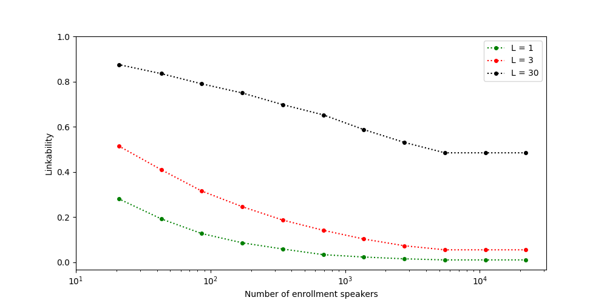

This repository is an implementation of the Linkability metric for voice anonymization evaluation depicted in (article)[lien] and the reproduction of the experiment they led on the CommonVoice Dataset.

---

## Metric Description 
The Linkability metric has been created to evaluate the second criteria defining anonymized data : *data can be considered anonymous if it is not possible to link records that pertain to the same data subject*

In the case of speech anonymization, Linkability measures the risk that an attacker matches a speaker embedding $x_{test}$ computed from one or more anonymized test utterances, with the enrollment embedding $x_{enroll}$  corresponding to the same speaker $i$ among a set of $N'$ enrollment speakers.

Linkage succeeds if:  

$$
s(x_{\text{test}}, x_{\text{enroll}}^i) > \max_{j \neq i} s(x_{\text{test}}, x_{\text{enroll}}^j)
$$

The Linkability metric is defined as the probability of linkage over all test data:

$$
\pi_{\text{link}} = \Pr \left( s(x_{\text{test}}^i, x_{\text{enroll}}^i) > \max_{j \neq i} s(x_{\text{test}}^i, x_{\text{enroll}}^j) \right)
$$

A low $\pi_{\text{link}}$ indicates that it is difficult for an attacker to correctly  
link anonymized recordings to the correct speaker, thus supporting the claim of effective anonymization.

## Installation
TO DO

## Usage
The metric computation revolves around two classes `SimMatrix` & `Scores`

#### SimMatrix
The `SimMatrix` class aims to compute the Cosine Similarity Matrix pairing each test utterances against each enroll utterances. 
It takes as arguments :
- `enroll_path` and `trial_path` :  the pickle files (test and enroll set) containing a dictionary of speaker embeddings of shape `embedding_dic[speaker_id] = List[speaker_embeddings]`
- `L` :  which is the number of utterances used to compute the embedding of each test speaker
- `seed` : to initialize the random number generator involved in the choice of the utterances chosen to compute the average embeddings
- `matrix_path` : if the SimMatrix has already been computed and saved

#### Scores
TO DO

### Result Example

